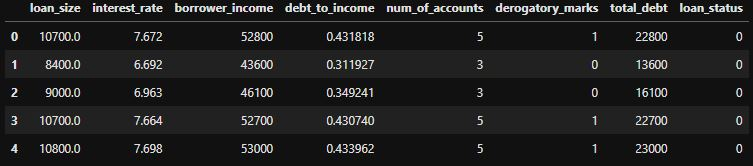
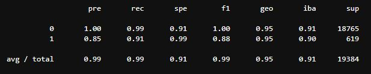
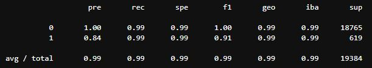

# Assignment---Module-12

## Overview of the Analysis

The pirpose of this analysis was to take a dataset of historical lending activity and build a model that could identify the creditworthiness of borrowers. An inherent problem in this analysis is the imbalanced nature of the dataset, where healthy loans outnumber risky loans. As such, it is necessary to somehow balance the dataset in order to produce a more effective model. In this case, over-sampling was used to address the problem of imbalanced data.

In the dataset, we have a collection of features and a target column of "loan_status". "loan_status" contains binary value - 0, 1 - where '0' represents a healthy loan and '1' represents a high-risk loan.

### Stages of Machine Learning Process

Data was read into a dataframe.

- The 'y' variable was set equal to the column "loan_status".
- The 'X' variable was set equal to the original dataframe minus the "loan_status" column.
- Using "value_counts() on the 'y' variable we can see that healthy loans - '0' - comprise 75036 values, while high risk loans - '1' - comprise only 2500. A clear and sizable imbalance in the data.
- The X and y variables are split into training and testing sets using the sklearn "train_tet_split" function
- A LogisticRegression model is then built, fitted with the training sets, and then used to generate predictions on the X_test dataset.
- The model was then evaluated using "balanced_accuracy_score"
- A confusion matrix was generated.
- A classification report was generated.

- RandomOverSampler was imported from imblearn and a RandomOverSampler model was initiated.
- The model was fit with the original split training data.
- The resampled target data 'y_resampled' was shown to now have equal value_counts() for both healthy and high risk loans (56271).
- Using the oversampled model, the resampled data was then fit, and the predction ran again.
- Once again a balanced accuracy score, confusion matrix and classification report were all generated.

## Results

- Machine Learning Model 1:

  - Description of Model 1 Accuracy, Precision, and Recall scores.

  * The balanced accuracy score for Machine Learning Model 1 was 0.9520479254722232, or 95%, which is a very good score.
  * The precision score for detecting healthy loans - '0' - was 100%, however the precision for detecting high risk loans - '1' - was 85%.
  * Recall for healthy loans was 99%, while for high risk loans it was 91%.

  

- Machine Learning Model 2:

  - Description of Model 2 Accuracy, Precision, and Recall scores.

  * The balanced accuracy score was 0.9936781215845847, or 99%.
    The precison score for detecting healthy loans - '0' - was 100%, however the precision for detecting high risk loans - '1' - was 84%.
  * Recall for healthy loans was 99%, and for high risk loans it was also 99%.

  

## Summary

For machine learning model 1, the accuracy score, precision and recall for predicting healthy loans were all very high, and this is no surprise given the weight of data in favor of healthy loans. However, recall was at 91% for high risk loans, indicating that false negatives were being predicted. Although 91% for recall is not a terrible score, given that we know we have imabalanced data, balancing out our data whould improve this score and make our model more effective at the task it is indended for - predicting high risk loans.

After rebalancing our data in machine learning model 2 our balanced accuracy score increased to near 100% (0.993) which is very good.

False Positives - missclassified healthy loans as high risk loans - were reduced from 56 in our original model down to 4 in our rebalanced model. This benefits the lending institution as it is able to make more loans that then generate fees.

False Negatives - misclassified high risk loans as healthy - increased from 102 to 116, which is not ideal.

Overall, recall improved from 91% to 99%, and this is a positive outcome.

I would try other resampling models before committing to one of the two models shown here, however, based on these two models alone I would choose the second. The improvement in accuracy score and recall is the main factor.
